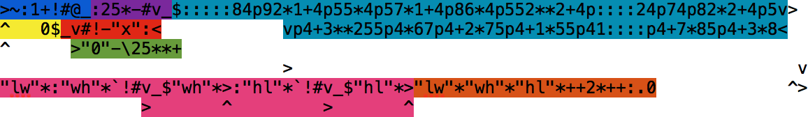
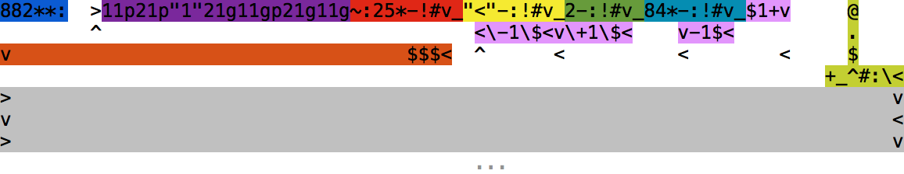
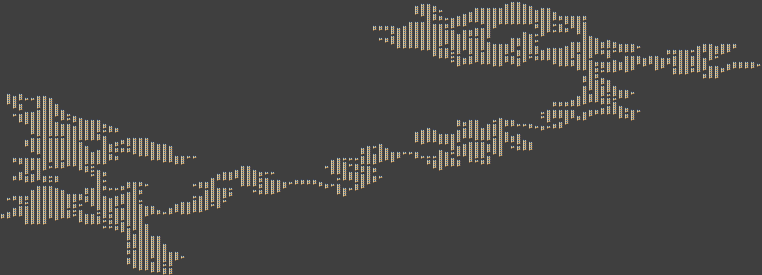

# Advent of Befunge

Advent of Code in Befunge

### Befunge Summary

[Befunge][befunge] is an esoteric two-dimensional stack language in which the
program counter travels around the 80x25 program space. In addition to the
stack, program space itself can be modified at runtime.

| Instruction | Description                    |
| ----------- | ------------------------------ |
| `>`         | Right                          |
| `<`         | Left                           |
| `^`         | Up                             |
| `v`         | Down                           |
| `?`         | Random direction               |
| `#`         | Jump over                      |
| `0` ... `9` | Push number                    |
| `"`         | Toggle string mode             |
| `:`         | Dup                            |
| `\`         | Swap                           |
| `$`         | Pop                            |
| `+`         | Add                            |
| `-`         | Subtract                       |
| `*`         | Multiply                       |
| `/`         | Divide                         |
| `%`         | Modulo                         |
| `!`         | Logical NOT                    |
| `` ` ``     | Greater than                   |
| `_`         | Horizontal if                  |
| `|`         | Vertical if                    |
| `g`         | Get                            |
| `p`         | Put                            |
| `&`         | Input number                   |
| `~`         | Input character                |
| `.`         | Output number                  |
| `,`         | Output character               |
| `@`         | Exit                           |
| other       | In string mode, push character |

[befunge]: http://catseye.tc/node/Befunge-93.html

### Development

Solutions run with [befrust][befrust] and debugged with [befungee][befungee].

[befrust]: https://github.com/programble/befrust
[befungee]: https://github.com/programble/befungee

## [Day 1: Not Quite Lisp][day1]

[Solution](day01.bf)

Note: input must not end in a newline.

1. Blue: standard input loop, exiting on EOF (-1).
2. Purple: subtract ASCII value of `)` from input, resulting in `-1` for `(`
   and `0` for `)`.
3. Red: add the logical NOT of the result to itself, resulting in `-1` for `(`
   and `1` for `)`.
4. Yellow: subtract the result from the total and output it.

## [Day 2: I Was Told There Would Be No Math][day2]

[Solution](day02.bf)

1. Blue: standard input loop, exiting on EOF (-1).
2. Purple: check for newline (10).
3. Red: check for "x".
4. Yellow: on "x", discard the input and push 0 for the next number.
5. Green: subtract ASCII value of "0" to convert input to number. Multiply
   existing number by 10 and add the input number.
6. Cyan: on newline, the length, width and height will be on the stack. Replace
   each "l", "w", "h" in the pink and orange regions with their values.
7. Pink: find the smallest side by calculating each and performing greater-than
   comparisons.
8. Orange: calculate the areas of each side, add them, and multiply by two. Add
   the area of the smallest side. Add the area to the total, output, then push
   0 for the next input value.

## [Day 3: Perfectly Spherical Houses in a Vacuum][day3]

[Solution](day03.bf)

Note: non-standard Befunge, 255x255 program space.

1. Blue: push starting coordinates `(128, 128)`, the center of a 255x255
   program space.
2. Purple: temporarily store coordinates under blue region, use them to write a
   `1` into the program space, then restore the coordinates to the stack.
3. Red: input loop checking for newline (10).
4. Yellow: compare input to "<", leaving the difference on the stack.
5. Green: compare input to 2, the difference between "<" and ">", again leaving
   the difference on the stack.
6. Cyan: compare input to 32, the difference between ">" and "^", again leaving
   the difference on the stack. It is assumed that any other value is "v".
7. Pink: pop input value and add or subtract 1 to the X or Y coordinate.
8. Orange: pop input and coordinates to empty the stack and enter the gray
   area.
9. Gray: region of program space populated with `1` instructions by the input
   loop, then executed.
10. Lime: sum the entire stack full of 1s, output the result and exit.

Map of the houses Santa visited in program space:

## [Day 4: The Ideal Stocking Stuffer][day4]

No solution yet.

## [Day 5: Doesn't He Have Intern-Elves For This?][day5]

No solution yet.

[day1]: http://adventofcode.com/day/1
[day2]: http://adventofcode.com/day/2
[day3]: http://adventofcode.com/day/3
[day4]: http://adventofcode.com/day/4
[day5]: http://adventofcode.com/day/5
